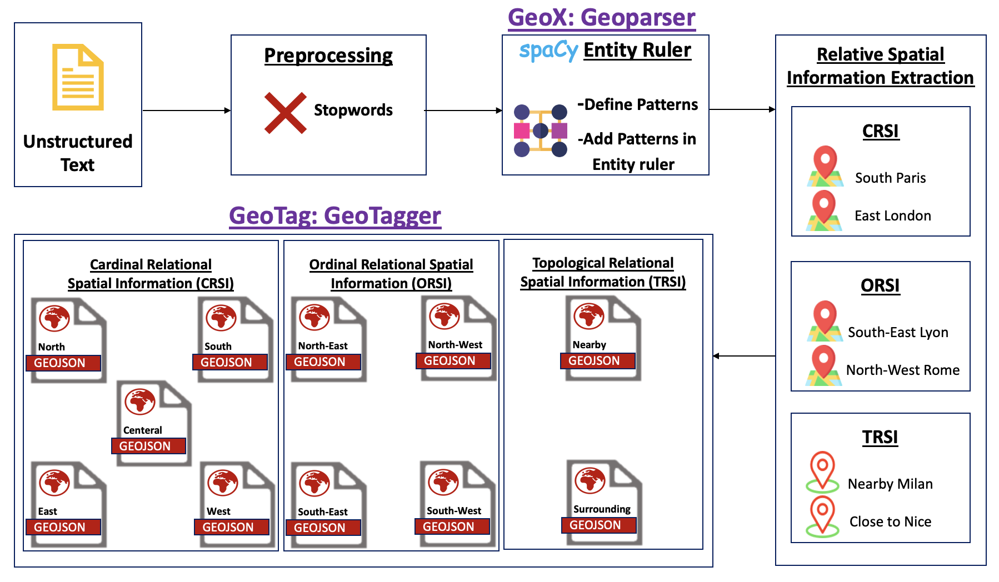
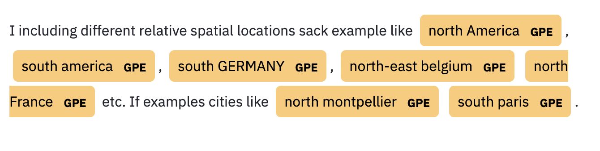

# GeoX - Extraction of Relative Spatial Information (RSI) from Text

## GeoX

**GeoX** is a web application built in Python language used for extracting relative spatial information (RSI) from text. 

## Live Demo Application 

[Live Demo](https://share.streamlit.io/anonymous-agile/rsi_parser/main/App.py)

## Process Pipeline



## Installation
There are few Python packages that are needed to install for running the GeoX demo application

1. Install spacy for natural language processing (NLP) tasks 
```sh
pip install spacy
```
2. Install gensim library for data preprocessing
```sh
pip install gensim
```
3. Install streamit library for running GeoX web application 
```sh
pip install streamlit
```
4. Install spacy-streamlit for display named entities (RSI) in the text 
```sh
pip install spacy-streamlit
```

## How to run the GeoX web application

```sh
streamlit run App.py
```

## Example 

Here is an example of input text with output having higlighted realtive spatial information (RSI).

**Text Input**
```
I am including some different relative spatial locations for the sack of example like north of America, south america, south of the GERMANY, north-east belgium and north of the France etc. If we go to some of the examples in cities like north of montpellier and south paris. 
```

**Expected Running time duration**
Expected running time of an example may be between 1-2 minutes. 


**Ouput**

